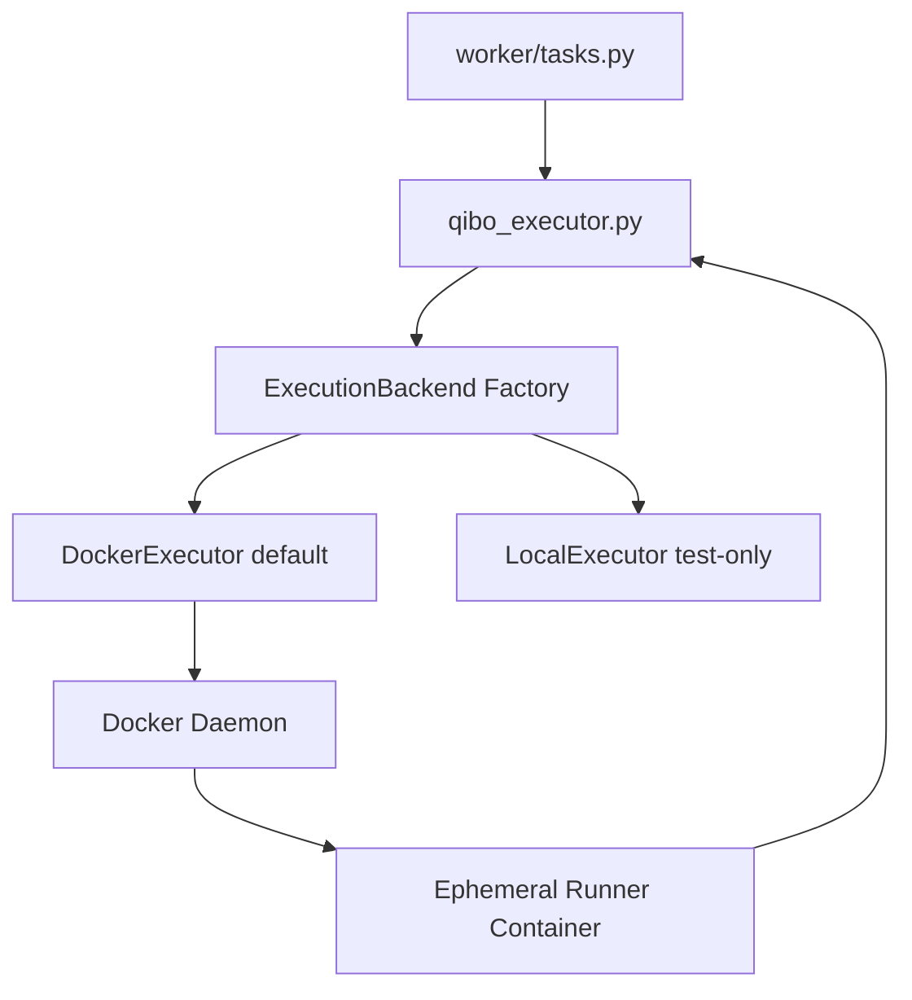

# Design Document

## Overview

本设计将后端任务执行链路从“进程内沙箱执行（`sandbox.py` + `exec`）”迁移为“容器隔离执行”，并采用方案 B：  
通过 `ExecutionBackend` 抽象隔离业务逻辑与执行实现，默认使用 `DockerExecutor`，仅在测试场景显式启用 `LocalExecutor`。  
迁移后，`/api/tasks/*` 接口、任务状态机（`PENDING/RUNNING/SUCCESS/FAILURE`）和结果结构保持不变，变更集中在 Worker 执行层。

## Steering Document Alignment

### Technical Standards (tech.md)

当前项目未提供 `tech.md`，本设计遵循 `.spec-workflow/steering/project-memory.md` 的约束：
- 后端保持 FastAPI + RQ + Redis + SQLite + Qibo，不引入新的远程基础设施。
- 保持 MVP 单体形态，改造仅落在 backend 代码与 compose 编排层。
- 失败显式暴露，不增加静默 fallback 或 mock 执行路径。

### Project Structure (structure.md)

当前项目未提供 `structure.md`，本设计延续现有目录职责：
- `backend/app/services/` 承载执行器抽象与实现。
- `backend/app/worker/` 保持任务编排与状态流转，不承载容器细节。
- `backend/tests/` 增加执行器与集成测试。
- `docker-compose.yml` 仅补充执行器所需运行时配置（worker 侧 Docker 访问能力）。

## Code Reuse Analysis

本次改造复用已有任务流转、结果标准化和配置体系，避免重写核心业务逻辑。

### Existing Components to Leverage

- **`backend/app/worker/tasks.py`**: 保留任务状态流转与错误落库逻辑，仅保持对 `execute_qibo_script` 的调用。
- **`backend/app/services/qibo_executor.py`**: 继续负责结果结构校验与标准化（`counts`/`probabilities`）。
- **`backend/app/core/config.py`**: 复用 Settings 入口，新增执行后端与容器限制相关配置。
- **`backend/app/models/task.py`**: 复用 `TaskStatus` 和错误字段，不新增表结构。
- **`docker-compose.yml`**: 在既有 `backend/worker/redis` 拓扑上补充 worker 的 Docker socket 挂载和配置。

### Integration Points

- **Worker 执行链路**: `run_quantum_task -> execute_qibo_script -> ExecutionBackend.execute`。
- **Docker 引擎**: `DockerExecutor` 通过 Docker API 创建短生命周期容器并回收。
- **结果回传**: 容器输出 JSON，交由 `qibo_executor` 继续统一标准化。
- **配置系统**: 所有后端选择与容器限制通过环境变量注入。

## Architecture

整体采用“业务层稳定 + 执行层可替换”的分层结构：

1. `worker/tasks.py` 负责任务生命周期与持久化。
2. `qibo_executor.py` 负责量子执行结果契约与兼容格式归一。
3. `ExecutionBackend` 抽象执行能力，屏蔽具体运行介质。
4. `DockerExecutor` 实现默认执行路径：构建容器输入、运行容器、收集输出、统一错误、回收资源。
5. `LocalExecutor` 仅用于测试显式启用，避免默认运行走不隔离路径。

### Modular Design Principles

- **Single File Responsibility**: 抽象定义、工厂选择、Docker 执行实现、Local 执行实现分别独立文件。
- **Component Isolation**: 业务代码不直接依赖 Docker SDK，统一依赖 `ExecutionBackend`。
- **Service Layer Separation**: Worker 编排层与执行基础设施层解耦。
- **Utility Modularity**: 容器日志解析、超时处理、错误映射拆为小函数，避免单函数复杂度过高。



## Components and Interfaces

### Component 1: Execution Contract
- **Purpose:** 定义执行输入/输出与统一执行接口，保证业务层稳定依赖。
- **Interfaces:** `ExecutionBackend.execute(code: str, timeout_seconds: int) -> dict`
- **Dependencies:** Python typing / dataclass（或 TypedDict）。
- **Reuses:** `qibo_executor` 的原有结果结构约束。

### Component 2: Backend Selector (Factory)
- **Purpose:** 根据配置选择执行后端实现，默认 `docker`。
- **Interfaces:** `get_execution_backend(settings) -> ExecutionBackend`
- **Dependencies:** `app.core.config.settings`。
- **Reuses:** 现有 `Settings` 配置加载机制。

### Component 3: DockerExecutor
- **Purpose:** 在短生命周期容器中执行用户代码并返回结构化结果。
- **Interfaces:** `execute(code, timeout_seconds)`，内部包含 create/start/wait/logs/remove 生命周期。
- **Dependencies:** Docker API 客户端、执行镜像、socket 访问。
- **Reuses:** 现有 `qibo` 运行环境依赖、错误落库语义。

### Component 4: LocalExecutor (Test-only)
- **Purpose:** 为单元测试或无 Docker CI 提供显式可控的本地执行路径。
- **Interfaces:** 与 `ExecutionBackend` 同签名。
- **Dependencies:** 现有 `sandbox.run_with_limits`（仅测试使用）。
- **Reuses:** 原有 AST 校验与超时机制代码。

### Component 5: Container Runner Script
- **Purpose:** 作为容器入口，读取代码输入、执行并将结果以 JSON 输出到 stdout。
- **Interfaces:** `python -m app.services.execution.runner`（或等效入口）。
- **Dependencies:** Qibo 依赖与标准库 JSON/traceback。
- **Reuses:** `qibo_executor` 兼容格式预期（`{'counts': ...}` 或 bitstring map）。

## Data Models

### Model 1: Execution Backend Config
```text
ExecutionBackendConfig
- execution_backend: str ("docker" | "local")
- exec_image: str (容器执行镜像标签)
- exec_network_disabled: bool (默认 true)
- exec_readonly_rootfs: bool (默认 true)
- exec_mem_limit_mb: int (例如 256)
- exec_cpu_quota: float (例如 0.5)
- exec_pids_limit: int (例如 64)
- exec_timeout_seconds: int (沿用 qibo_exec_timeout_seconds)
```

### Model 2: Execution Result Contract
```text
ExecutionResult
- counts: dict[str, int]
- probabilities: dict[str, float] (可由 counts 推导)
- meta: dict[str, str | int] (可选，如 container_exit_code / duration_ms)
```

## Error Handling

### Error Scenarios
1. **Scenario 1: Docker 不可用（socket 不存在或权限不足）**
   - **Handling:** `DockerExecutor` 抛出带错误码的执行异常（如 `DOCKER_UNAVAILABLE`），Worker 标记 `FAILURE`。
   - **User Impact:** 查询结果接口返回失败状态，错误信息可定位为 Docker 运行条件问题。

2. **Scenario 2: 容器执行超时**
   - **Handling:** 强制停止并删除容器，抛出 `EXECUTION_TIMEOUT`。
   - **User Impact:** 任务进入 `FAILURE`，错误信息明确超时而非未知错误。

3. **Scenario 3: 容器输出非 JSON 或结果格式非法**
   - **Handling:** 解析失败抛出 `INVALID_EXEC_OUTPUT`，由 `qibo_executor` 保持现有契约校验。
   - **User Impact:** 任务失败且可诊断为用户脚本输出不符合约定。

4. **Scenario 4: 容器非零退出码**
   - **Handling:** 采集 stderr/exit code，映射为 `CONTAINER_EXIT_ERROR`。
   - **User Impact:** 任务失败，错误信息包含必要上下文（退出码/摘要日志）。

## Testing Strategy

### Unit Testing
- 覆盖 `ExecutionBackend` 工厂选择逻辑（默认 docker、测试切换 local、非法配置报错）。
- 覆盖 `DockerExecutor` 的错误映射与输出解析（使用 mock docker client，避免真实 Docker 依赖）。
- 覆盖 `qibo_executor` 在新后端下的结果标准化逻辑不回归。

### Integration Testing
- 新增 worker 侧集成测试：模拟执行成功、超时、容器异常退出，验证任务状态和错误写库语义。
- 验证 API 契约不变：`submit/status/result` 响应字段保持兼容。

### End-to-End Testing
- 在 docker compose 环境下提交真实任务，验证：
  - 任务成功执行并返回标准结果；
  - 失败路径可见且无“假成功”；
  - 执行后无残留运行容器。
