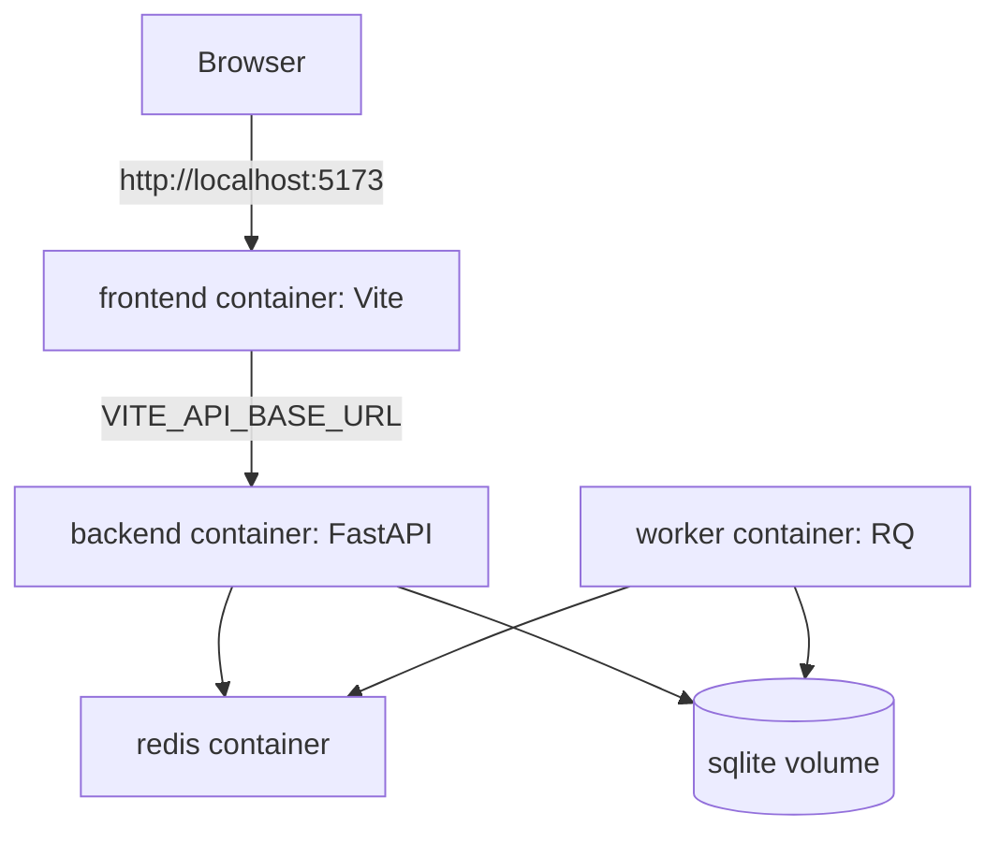

# Design Document

## Overview

本设计将 QCP MVP 运行链路容器化为开发/演示模式，目标是通过单一 Docker Compose 编排统一启动前端、后端 API、Worker 与 Redis，并保持现有业务闭环（登录、提交任务、轮询状态、展示结果）不变。设计优先开发效率与可复现性，明确不做生产级部署优化（如 Nginx 反向代理、多环境镜像矩阵、数据库迁移到 PostgreSQL）。

## Steering Document Alignment

### Technical Standards (tech.md)

当前 steering 中明确技术栈包含 React/Vite、FastAPI、SQLite、Redis、Qibo，且强调“本地优先、最小可运行闭环”。本设计遵循该方向，不新增与 MVP 闭环无关的基础设施，仅增加 Docker 运行层。

### Project Structure (structure.md)

实现将保持现有 `frontend/`、`backend/`、`scripts/` 结构不变，在仓库根目录增量引入容器编排文件（`docker-compose.yml`）与必要镜像定义文件（Dockerfile / ignore 文件），避免重排业务代码目录。

## Code Reuse Analysis

本特性以“运行方式改造”为主，最大化复用现有应用代码与脚本接口。

### Existing Components to Leverage

- **`backend/app/main.py`**: 继续作为 API 入口，仅调整 CORS 读取方式以适配容器化配置。
- **`backend/app/worker/rq_worker.py`**: 继续作为 Worker 入口，按容器平台兼容性优化 Worker 类选择策略。
- **`backend/app/core/config.py`**: 继续作为统一配置入口，通过环境变量覆盖容器网络参数。
- **`backend/app/db/session.py`**: 现有 SQLite 路径归一化逻辑可直接复用，配合挂载卷实现持久化。
- **`frontend/src/api/client.ts`**: 保留 `VITE_API_BASE_URL` 机制，避免写死容器服务名导致浏览器不可达。
- **`scripts/dev-health-check.ps1`**: 保留本机健康检查逻辑，并补充 Docker 场景等价验证路径。

### Integration Points

- **Compose 网络**: `backend` / `worker` 使用 `redis` 服务名连接 Redis。
- **Browser → API**: 前端仍由浏览器访问宿主机映射端口，不走容器内部 DNS。
- **Storage**: `backend` 与 `worker` 共享 SQLite 数据卷路径，保证容器重建后数据保留。

## Architecture

采用单 compose 项目 + 四服务架构：

1. `frontend`：Vite 开发服务，源码挂载，宿主机端口暴露。
2. `backend`：FastAPI 开发服务，源码挂载，宿主机端口暴露。
3. `worker`：RQ 任务消费进程，与 backend 复用同一后端镜像。
4. `redis`：官方 Redis 镜像，作为队列中间件。

该架构在 MVP 期满足最小复杂度与快速迭代，避免过早引入双模式编排或生产部署组件。

### Modular Design Principles

- **Single File Responsibility**: Compose 负责服务编排；Dockerfile 负责镜像构建；应用代码仅做配置兼容改造。
- **Component Isolation**: 前端、后端、Worker、Redis 各自独立服务，职责明确。
- **Service Layer Separation**: 业务逻辑不移入编排层；容器层仅提供运行环境。
- **Utility Modularity**: 健康检查与启动命令按“本机模式 / Docker 模式”分离描述，避免脚本职责混乱。



## Components and Interfaces

### Component 1: Compose Orchestration
- **Purpose:** 提供统一的多服务启动、网络、卷与环境变量注入能力。
- **Interfaces:** `docker compose up --build` / `docker compose down` / `docker compose logs`。
- **Dependencies:** Docker Desktop + Compose 插件。
- **Reuses:** 现有服务启动命令、端口约定、环境变量键名。

### Component 2: Backend Runtime Image
- **Purpose:** 为 API 与 Worker 提供一致 Python 运行时与依赖。
- **Interfaces:** API 命令 `uvicorn app.main:app ...`；Worker 命令 `python -m app.worker.rq_worker`。
- **Dependencies:** `backend/requirements.txt`、Qibo 运行依赖。
- **Reuses:** `backend/app/*` 全量业务代码。

### Component 3: Frontend Runtime Image
- **Purpose:** 运行 Vite 开发服务并暴露前端访问入口。
- **Interfaces:** `npm run dev`。
- **Dependencies:** `frontend/package.json` 与 node_modules。
- **Reuses:** `frontend/src/*`、`vite.config.ts`。

### Component 4: Runtime Configuration Contract
- **Purpose:** 规范容器化场景下连接参数与跨域策略。
- **Interfaces:** `DATABASE_URL`、`REDIS_URL`、`VITE_API_BASE_URL`、`CORS_ALLOW_ORIGINS`（新增）。
- **Dependencies:** `backend/app/core/config.py`、`backend/app/main.py`、`frontend/src/api/client.ts`。
- **Reuses:** 现有 `.env.example` 与 settings 体系。

## Data Models

### Model 1: Container Runtime Config
```text
ContainerRuntimeConfig
- env: string (default "dev")
- api_host: string (0.0.0.0)
- api_port: integer (8000)
- database_url: string (sqlite:///./data/qcp.db or overridden)
- redis_url: string (redis://redis:6379/0 in compose)
- vite_api_base_url: string (browser-visible backend URL)
- cors_allow_origins: string list (comma-separated)
```

### Model 2: Compose Service Topology
```text
ServiceSpec
- name: frontend | backend | worker | redis
- image/build: docker build context + Dockerfile
- command: runtime command per service
- ports: host:container mappings
- volumes: bind mounts or named volumes
- depends_on: startup dependency hints
- healthcheck: optional readiness probes
```

## Error Handling

### Error Scenarios
1. **Scenario 1: backend/worker 连接 Redis 失败（localhost 配置遗留）**
   - **Handling:** 在 compose 内显式设置 `REDIS_URL=redis://redis:6379/0`；启动失败时保留显式错误日志，不做静默降级。
   - **User Impact:** 服务启动失败可见且可定位，修复后重启即可恢复。

2. **Scenario 2: 前端请求后端失败（API 基址误配为容器服务名）**
   - **Handling:** 规定 `VITE_API_BASE_URL` 必须是浏览器可访问地址（如 `http://127.0.0.1:8000`）。
   - **User Impact:** 避免浏览器 DNS 解析失败导致“前端可打开但接口全失败”。

3. **Scenario 3: SQLite 数据丢失（未挂载卷）**
   - **Handling:** 在 compose 强制为数据库目录配置 named volume；文档明确重建与清理命令影响。
   - **User Impact:** 默认重建容器后数据仍在；仅显式删除卷时才会丢失。

4. **Scenario 4: 容器热更新不生效（Windows 挂载监听问题）**
   - **Handling:** 通过容器环境变量启用轮询监听策略；文档记录已知限制与排障步骤。
   - **User Impact:** 开发迭代效率保持可用，不需要每次手工重建镜像。

## Testing Strategy

### Unit Testing

- 保持现有后端 `pytest` 与前端测试命令可运行。
- 修正与容器平台相关的测试脆弱点（如测试清理硬编码 Windows 绝对路径）。

### Integration Testing

- 基础联调检查：
  - Redis 端口可达；
  - `GET /api/health` 返回 `status=ok`；
  - 前端页面可访问。
- 深度联调检查：
  - 注册/登录；
  - 任务提交；
  - 任务状态查询；
  - 结果查询。

### End-to-End Testing

- 使用 Docker Compose 作为统一测试运行环境。
- 验证“从 `docker compose up --build` 到前端结果展示”的完整用户路径。
- 验证容器重建后 SQLite 数据仍可读取。
