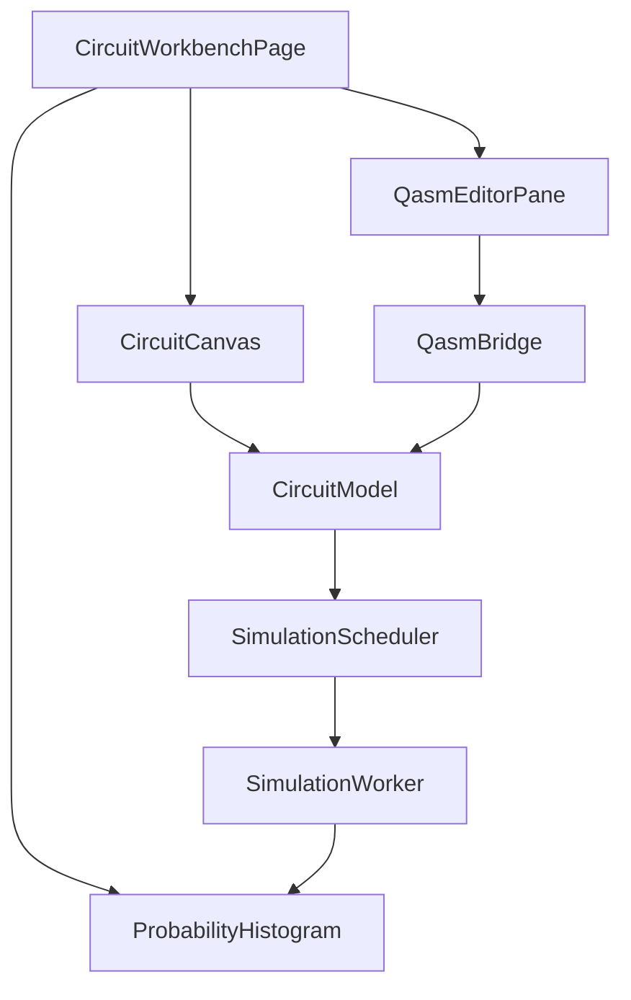

# Design Document

## Overview

本特性在前端新增“图形化量子工作台”，实现左侧拖拽式电路编辑、右侧可编辑 OpenQASM 3、浏览器本地实时仿真与基态概率直方图。系统保持“电路模型单一真源 + 文本双向同步 + 计算与 UI 分离”的架构，替换当前主入口的“提交代码后端异步执行”体验，同时保留旧代码模式入口。

## Steering Document Alignment

### Technical Standards (tech.md)

当前仓库未提供 `tech.md`，本设计遵循既有技术栈与代码约束：

1. 前端继续使用 React + TypeScript + Vite + Monaco + ECharts。
2. 严格模块化拆分，避免在页面层堆积业务逻辑。
3. 保持失败显式化，不新增静默降级路径。
4. 复杂度与性能控制通过前端硬限制实现，不引入后端兜底执行。

### Project Structure (structure.md)

当前仓库未提供 `structure.md`，本设计对齐现有目录风格：

1. 页面放在 `frontend/src/pages/`。
2. 通用展示组件放在 `frontend/src/components/`。
3. 新增领域逻辑与纯函数放在 `frontend/src/features/circuit/`（按 model/qasm/simulation 分层）。
4. 测试统一在 `frontend/src/tests/`。

## Code Reuse Analysis

新功能以复用现有路由、鉴权与图表能力为主，不修改后端任务 API 契约。

### Existing Components to Leverage
- **ProtectedRoute**: 继续复用受保护路由机制，确保新页面沿用登录态校验。
- **CodeEditor**: 复用 Monaco 封装思路，衍生 QASM 编辑面板。
- **ResultChart**: 复用 ECharts 渲染基础能力，扩展为“过滤后概率分布 + 统计信息”。
- **toErrorMessage**: 复用前端错误消息归一化方式，统一错误展示文案。

### Integration Points
- **App 路由系统**: 从单一路由 `/tasks` 扩展为 `/tasks/circuit`（新主入口）与 `/tasks/code`（旧入口）。
- **前端状态管理**: 在页面本地状态基础上增加 `CircuitModel`、QASM 文本、仿真状态、错误状态四类核心状态。
- **后端 API**: 图形化模式不依赖后端仿真；旧代码模式仍走 `submit/status/result` API。

## Architecture

采用“主线程 UI + Web Worker 计算”的双通道结构：

1. 主线程负责拖拽交互、QASM 编辑、状态编排、图表渲染。
2. Worker 负责电路仿真与概率计算，避免阻塞 UI。
3. `CircuitModel` 为唯一真源；左侧操作和右侧 QASM 编辑都必须先转成模型再执行仿真。
4. 右侧非法 QASM 明确报错，不污染左侧有效模型。

### Modular Design Principles
- **Single File Responsibility**: 类型定义、转换逻辑、调度逻辑、UI 组件分别独立文件。
- **Component Isolation**: 门库、画布、QASM 面板、错误面板、图表组件分离。
- **Service Layer Separation**: QASM 解析与仿真调度为服务层纯逻辑，页面层仅编排。
- **Utility Modularity**: 复杂度检查、概率过滤、错误映射均为纯函数模块。



## Components and Interfaces

### CircuitWorkbenchPage
- **Purpose:** 编排左栏/右栏/图表，管理同步和执行状态。
- **Interfaces:** 页面级状态与回调（`onCircuitChange`, `onQasmChange`）。
- **Dependencies:** `CircuitModel`、`QasmBridge`、`SimulationScheduler`。
- **Reuses:** `ProtectedRoute`、现有布局与错误展示模式。

### GatePalette
- **Purpose:** 展示门库并提供拖拽源。
- **Interfaces:** `onGateDragStart(gateName)`。
- **Dependencies:** 门定义常量。
- **Reuses:** 无。

### CircuitCanvas
- **Purpose:** 按 qubit/layer 渲染线路并接收放置操作。
- **Interfaces:** `circuit`, `onCircuitChange(next)`, `onDeleteOperation(id)`。
- **Dependencies:** `CircuitModel` 类型、复杂度提示。
- **Reuses:** 现有 React 组件模式。

### QasmEditorPane
- **Purpose:** 可编辑 OpenQASM 3 文本并反馈解析结果。
- **Interfaces:** `value`, `onValidQasm(model)`, `onParseError(error)`。
- **Dependencies:** Monaco、`QasmBridge`。
- **Reuses:** `CodeEditor` Monaco 配置风格。

### QasmBridge
- **Purpose:** `CircuitModel <-> OpenQASM 3` 子集转换。
- **Interfaces:** `toQasm3(model)`, `fromQasm3(source)`。
- **Dependencies:** 语法/语义校验模块。
- **Reuses:** 现有错误归一化方式。

### SimulationScheduler
- **Purpose:** 防抖调度、取消旧任务、超时控制。
- **Interfaces:** `schedule(model): Promise<SimulationResult>`。
- **Dependencies:** `SimulationWorker` 客户端。
- **Reuses:** 无。

### SimulationWorker
- **Purpose:** 执行本地仿真和概率计算。
- **Interfaces:** message 协议 `{requestId, model}` -> `{requestId, probabilities}`。
- **Dependencies:** 浏览器 Worker API。
- **Reuses:** 无。

## Data Models

### CircuitModel
```ts
interface CircuitModel {
  numQubits: number; // 1..10
  operations: Operation[]; // ordered by layer then insertion order
}
```

### Operation
```ts
interface Operation {
  id: string;
  gate: "i" | "x" | "y" | "z" | "h" | "s" | "sdg" | "t" | "tdg" |
        "rx" | "ry" | "rz" | "u" | "cx" | "cz" | "swap" | "m";
  targets: number[];    // required
  controls?: number[];  // optional for controlled gates
  params?: number[];    // angle params in radians
  layer: number;        // non-negative integer
}
```

### ComplexityReport
```ts
interface ComplexityReport {
  ok: boolean;
  qubits: number;
  depth: number;
  totalGates: number;
  code?: "QUBIT_LIMIT_EXCEEDED" | "DEPTH_LIMIT_EXCEEDED" | "GATE_LIMIT_EXCEEDED";
  message?: string;
}
```

### ProbabilityView
```ts
interface ProbabilityView {
  visible: Record<string, number>;
  hiddenCount: number;
  totalCount: number;
  visibleCount: number;
  probabilitySum: number;
  epsilon: number; // epsilon = 2^-(n+2)
}
```

## Error Handling

### Error Scenarios
1. **QASM 语法错误或不支持语句**
   - **Handling:** `fromQasm3` 返回结构化错误（含行号、原因），拒绝同步模型。
   - **User Impact:** 右侧显示错误；左侧维持上一次有效电路。

2. **复杂度超限（qubits/depth/gates）**
   - **Handling:** `ComplexityGuard` 直接阻断仿真并输出当前值/阈值。
   - **User Impact:** 显示明确超限提示，图表不更新为新结果。

3. **Worker 超时或执行失败**
   - **Handling:** 调度器返回显式错误码（如 `SIM_TIMEOUT` / `SIM_EXEC_ERROR`）。
   - **User Impact:** 显示失败信息，保留最近一次成功图表用于对照。

4. **并发编辑导致旧结果回写**
   - **Handling:** 使用 `requestId/version` 丢弃过期响应。
   - **User Impact:** 用户仅看到最新编辑对应的结果。

## Testing Strategy

### Unit Testing
- `ComplexityGuard`：三类上限判断与错误码。
- `ProbabilityFilter`：`epsilon = 2^-(n+2)` 过滤与统计。
- `QasmBridge`：双向转换、非法输入报错、门参数校验。

### Integration Testing
- 组件集成：`CircuitCanvas -> CircuitModel -> QasmEditorPane` 同步流程。
- 调度集成：防抖、取消旧任务、超时控制。
- 路由集成：`/tasks/circuit` 与 `/tasks/code` 的受保护访问。

### End-to-End Testing
- 用户拖拽门后实时出图。
- 用户编辑合法 QASM 后图形同步更新。
- 用户输入非法 QASM 时左侧不变且有错误提示。
- 复杂度超限时仿真被阻断并提示原因。

