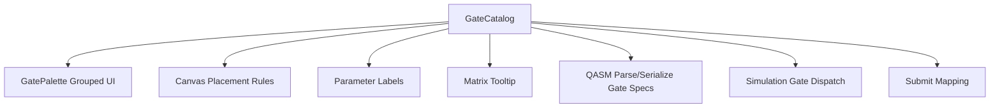

# Design Document

## Overview

本设计将图形化工作台中的量子门能力从“平铺硬编码”升级为“统一门目录（Gate Catalog）驱动”，覆盖以下目标：

1. 门面板按类别分组并配色，降低查找成本。
2. 鼠标悬浮/键盘聚焦门项时展示矩阵 tooltip，增强教学与可解释性。
3. 新增 `p`、`cp`、`ccx`，并确保图形编辑、QASM 导入导出、本地模拟、任务提交四条链路一致。

该设计遵循当前前端架构（React + TypeScript + 局部业务模块）并保持 Debug-First：任何未支持路径都显式报错，不引入静默降级。

## Steering Document Alignment

### Technical Standards (tech.md)

- 保持单体前端工程内模块化拆分，不引入额外框架依赖。
- 保持显式失败策略：对未映射 gate 的 parse/serialize/simulate/submit 路径抛出明确错误。
- 使用不可变数据模型更新 `CircuitModel`，避免隐式状态修改。

### Project Structure (structure.md)

沿用现有 `frontend/src/features/circuit/*` 与 `frontend/src/components/circuit/*` 分层：

- `features/circuit/gates/*`：新增门目录与矩阵元数据（纯数据/纯函数）。
- `components/circuit/GatePalette.tsx`：改为目录驱动渲染（分组、颜色、tooltip）。
- `components/circuit/CircuitCanvas.tsx` 与 `canvas-gate-utils.ts`：扩展 `cp/ccx` 放置交互。
- `features/circuit/qasm/*`、`simulation/*`、`submission/*`：补齐新门链路支持。

## Code Reuse Analysis

### Existing Components to Leverage

- **`GatePalette`**：已有拖拽协议 `application/x-qcp-gate` 可复用，仅替换数据源与 UI 渲染方式。
- **`CircuitCanvas`**：已有单比特/双比特放置框架，可扩展为“可变步数放置状态机”。
- **`OperationParameterPanel`**：已有参数门编辑能力，可扩展 `p`、`cp` 参数标签。
- **`qasm-parser` / `qasm-bridge`**：已有 gate spec 与序列化骨架，追加新 gate 分支即可。
- **`simulation-core`**：已有单比特、受控门、交换门执行框架，可新增 `cp`/`ccx` 执行器。
- **`circuit-task-submit`**：已有 gate 到 Qibo 代码映射框架，可扩展新门映射/分解。

### Integration Points

- **UI 集成点**：`CircuitWorkbenchPage -> GatePalette + CircuitCanvas`。
- **数据一致性点**：`GateName` 类型、parser spec、serializer、simulator、submitter 需保持同源定义。
- **测试集成点**：现有 `qasm-bridge.test.ts`、`qasm-parser.test.ts`、`simulation-worker.test.ts`、`circuit-task-submit.test.ts`、`circuit-canvas.test.tsx` 扩展断言。

## Architecture

核心方案：引入统一 `GateCatalog`，以“目录定义 -> 多处消费”替换“多处硬编码”。



### Modular Design Principles

- **Single File Responsibility**：
  - `gate-catalog.ts` 仅维护 gate 元数据与分类。
  - `gate-matrix-preview.ts` 仅负责 tooltip 矩阵文本生成。
  - `GatePalette.tsx` 仅负责展示与交互，不承担量子语义计算。
- **Component Isolation**：
  - `GateMatrixTooltip` 作为独立展示组件，避免 GatePalette 组件膨胀。
- **Service Layer Separation**：
  - QASM / Simulation / Submit 分别独立映射，复用 catalog 的 gate 身份与基础元信息。
- **Utility Modularity**：
  - 复用/扩展 `canvas-gate-utils.ts`，将放置步数与 gate arity 解耦。

## Components and Interfaces

### Component 1: Gate Catalog (`features/circuit/gates/gate-catalog.ts`)
- **Purpose:** 提供统一门定义。
- **Interfaces:**
  - `GateCategory = "single" | "controlled" | "measurement"`
  - `GatePlacementKind = "single" | "two-qubit" | "multi-control"`
  - `GateCatalogItem`:
    - `name: GateName`
    - `label: string`
    - `category: GateCategory`
    - `colorToken: string`
    - `parameterLabels: readonly string[]`
    - `placementKind: GatePlacementKind`
    - `controlCount: number`
    - `targetCount: number`
  - `getGateCatalog(): readonly GateCatalogItem[]`
  - `getGateByName(name: GateName): GateCatalogItem`
- **Dependencies:** `features/circuit/model/types.ts`
- **Reuses:** 现有 `GateName` 类型系统

### Component 2: Gate Matrix Preview (`features/circuit/gates/gate-matrix-preview.ts`)
- **Purpose:** 生成 tooltip 矩阵文本（固定门直接给定；参数门给符号矩阵）。
- **Interfaces:**
  - `getGateMatrixPreview(name: GateName): { title: string; body: string }`
- **Dependencies:** 无 UI 依赖，纯函数。
- **Reuses:** `GateName`

### Component 3: Grouped Palette UI (`components/circuit/GatePalette.tsx`)
- **Purpose:** 按类别展示门，并按类别配色；支持 tooltip。
- **Interfaces:**
  - `GatePaletteProps` 保持可选 gate 过滤能力。
  - 新增可选 `showMatrixTooltip?: boolean`（默认启用）。
- **Dependencies:** GateCatalog + GateMatrixPreview
- **Reuses:** 既有 DnD 协议与 test id 规范

### Component 4: Placement State Extension (`components/circuit/canvas-gate-utils.ts`, `CircuitCanvas.tsx`)
- **Purpose:** 支持 `cp`（一控一靶）与 `ccx`（二控一靶）放置。
- **Interfaces:**
  - `PendingPlacement` 统一结构：
    - `gate: GateName`
    - `layer: number`
    - `selectedQubits: readonly number[]`
    - `requiredQubits: number`
    - `controlCount: number`
    - `targetCount: number`
  - `buildOperationFromPlacement(...)`
- **Dependencies:** GateCatalog
- **Reuses:** 现有 cell click/drop 流程

### Component 5: Execution Mapping Updates
- **QASM (`qasm-parser-types.ts`, `qasm-bridge.ts`, `qasm-parser-utils.ts`)**
  - 新增 gate specs: `p`, `cp`, `ccx`
  - `p(theta) q[i];`, `cp(theta) q[c], q[t];`, `ccx q[c1], q[c2], q[t];`
- **Simulation (`simulation-core.ts`)**
  - `p`: 对目标比特 `|1>` 分量施加相位 `e^{iλ}`
  - `cp`: 控制与目标都为 1 时施加相位 `e^{iλ}`
  - `ccx`: 两控制位为 1 时翻转目标位
- **Submission (`circuit-task-submit.ts`)**
  - `p` -> 显式映射到可执行代码（优先原生 gate；若无则使用可验证分解）
  - `cp` -> 显式映射或分解为受控相位等效序列
  - `ccx` -> 显式映射或分解为基础门序列
  - 保持“映射不存在即抛错”的显式策略

## Data Models

### Gate Catalog Item
```ts
type GateCatalogItem = {
  readonly name: GateName;
  readonly label: string;
  readonly category: "single" | "controlled" | "measurement";
  readonly colorToken: string;
  readonly parameterLabels: readonly string[];
  readonly placementKind: "single" | "two-qubit" | "multi-control";
  readonly controlCount: number;
  readonly targetCount: number;
};
```

### Matrix Preview Payload
```ts
type GateMatrixPreview = {
  readonly title: string;
  readonly body: string; // monospaced matrix text
};
```

### Pending Placement
```ts
type PendingPlacement = {
  readonly gate: GateName;
  readonly layer: number;
  readonly selectedQubits: readonly number[];
  readonly requiredQubits: number; // controls + targets
  readonly controlCount: number;
  readonly targetCount: number;
};
```

## Visual Specification

### Gate Category Colors

- `single`：蓝色系（示例 `#1d4ed8`）
- `controlled`：绿色系（示例 `#15803d`）
- `measurement`：灰色系（示例 `#4b5563`）

颜色通过 catalog `colorToken` 提供，GatePalette 只消费，不自行分配。

### Matrix Tooltip Content Rules

- 固定单比特门：显示 `2x2` 数值矩阵。
- 参数门 `rx/ry/rz/u/p/cp`：显示符号矩阵（`theta`/`phi`/`lambda`）。
- `ccx`：显示 `8x8` 矩阵（可采用紧凑文本表示，但必须体现矩阵形式）。

## Interaction Design

### `cp` 放置流程（2 步）
1. 拖拽 `cp` 到源 qubit+layer，记录 control。
2. 点击同层另一 qubit 作为 target，提交操作，默认参数 `lambda=0`。

### `ccx` 放置流程（3 步）
1. 拖拽 `ccx` 到源 qubit+layer，记录 control-1。
2. 点击同层另一 qubit，记录 control-2。
3. 点击同层第三个不同 qubit 作为 target，提交操作。

系统在每一步显示明确引导消息与错误提示（同层约束、重复 qubit 禁止、目标格占用等）。

## Error Handling

### Error Scenarios
1. **目录与执行映射不一致**
   - **Handling:** 在 parse/serialize/simulate/submit 路径抛显式 `unsupported gate`。
   - **User Impact:** UI 显示可定位错误，不静默丢弃。

2. **`ccx` 放置过程中选择了重复 qubit 或错误层**
   - **Handling:** 保持 pending 状态并显示可操作提示；不提交非法操作。
   - **User Impact:** 可继续修正步骤，不会污染电路。

3. **tooltip 矩阵定义缺失**
   - **Handling:** 显示“矩阵预览暂不可用”，并写入开发日志（不阻塞拖拽）。
   - **User Impact:** 功能部分可用，问题可见且可追踪。

4. **QASM 导入包含新门但参数/操作数错误**
   - **Handling:** 沿用现有解析错误模型返回 `INVALID_PARAMETER` / `INVALID_OPERAND`。
   - **User Impact:** 错误定位到行号与片段。

## Testing Strategy

### Unit Testing
- `gate-catalog`：
  - 分类完整性、颜色 token 存在性、`p/cp/ccx` 元数据正确。
- `gate-matrix-preview`：
  - `p/cp/ccx` 返回矩阵文本不为空，符号参数正确。
- `canvas-gate-utils`：
  - `cp` 两步、`ccx` 三步构造出的 operation controls/targets 正确。

### Integration Testing
- `GatePalette`：
  - 按分组渲染、颜色样式存在、tooltip 在 hover/focus 出现。
- `CircuitCanvas`：
  - `cp/ccx` 放置全流程、非法步骤提示、参数面板编辑（`p/cp`）。
- `qasm`：
  - `toQasm3` 与 `parseQasm3` 对 `p/cp/ccx` round-trip 正确。
- `simulation`：
  - 包含 `p/cp/ccx` 的电路概率结果与预期一致。
- `submission`：
  - 生成代码包含新门映射/分解并可通过现有代码构建断言。

### End-to-End Testing
- 用户从门库拖拽 `p/cp/ccx` 构建电路 -> 查看 tooltip -> 本地模拟（`numQubits <= 10`）-> 提交任务全链路验证。
- `numQubits > 10` 时保持既有行为：仅禁本地模拟，不阻断提交流程（与已落地策略一致）。
