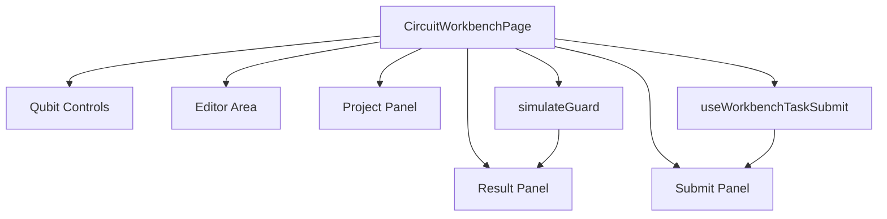

# Design Document

## Overview

本设计实现图形化工作台 P0 交互优化，范围限定为：

1. 页面布局重排：结果面板紧跟编辑区下方，提交面板紧跟结果面板下方。
2. 增加量子比特增减控件：`+Qubit/-Qubit`。
3. 规则解耦：允许 `numQubits > 10` 的编辑与提交，仅在浏览器本地模拟时禁用并显示显式提示。

设计原则是最小侵入现有链路，不改后端协议，不引入新状态库，不隐藏失败。

## Steering Document Alignment

### Technical Standards (tech.md)

项目未提供 `tech.md`，本设计遵循现有工程基线与 AGENTS 约束：

- 前端以 React 函数组件 + hooks 为核心。
- 保持 Debug-First：`>10` 不做静默降级，必须给出可见文案。
- 避免过度设计：仅实现 P0 所需能力。

### Project Structure (structure.md)

项目未提供 `structure.md`，本设计沿用当前目录组织：

- 页面编排保持在 `frontend/src/pages/CircuitWorkbenchPage.tsx`
- 电路编辑组件在 `frontend/src/components/circuit/*`
- 模型与规则在 `frontend/src/features/circuit/model/*`
- 模拟逻辑在 `frontend/src/features/circuit/simulation/*`
- 提交流程在 `frontend/src/features/circuit/submission/*`

## Code Reuse Analysis

### Existing Components to Leverage

- **`CircuitWorkbenchPage`**: 复用现有状态编排与页面结构，新增/调整区块顺序与 qubit 控件接线。
- **`CircuitCanvas`**: 继续作为电路可视编辑主体，仅接收更新后的 `CircuitModel`。
- **`WorkbenchResultPanel`**: 复用结果展示与状态文案通道，补充“本地模拟禁用”提示分支。
- **`WorkbenchSubmitPanel`**: 复用提交 UI 与状态显示，仅调整页面位置。
- **`useWorkbenchTaskSubmit`**: 复用提交与状态刷新能力，剥离对 `QUBIT_LIMIT_EXCEEDED` 的阻塞依赖。
- **`validateCircuitModel`**: 继续作为提交与模拟共享的结构合法性校验。

### Integration Points

- **页面编排层**: `CircuitWorkbenchPage` 负责把 `circuit` 状态同时传给模拟链路与提交流程。
- **模型规则层**: 在 `complexity-guard` 与提交阻塞逻辑之间拆分“模拟限制”和“提交限制”。
- **任务提交 API**: 继续调用 `/api/tasks/submit`，不改请求结构。
- **本地存储草稿**: 继续使用 `saveWorkbenchDraft`，保持行为一致。

## Architecture

核心改动是“规则分层 + 页面重排”：

1. 页面层：重排组件顺序，形成 `Editor -> Result -> Submit -> Project`。
2. 规则层：引入模拟专用门禁（`simulateGuard`），把 qubit 上限限制从提交路径移除。
3. 交互层：新增 qubit 调整动作，统一走 `pushCircuit` 更新历史与状态。

### Modular Design Principles

- **Single File Responsibility**:  
  - `CircuitWorkbenchPage` 负责编排与事件绑定。  
  - `complexity-guard` 负责复杂度规则。  
  - `useWorkbenchTaskSubmit` 负责提交阻塞判断与 API 调用。
- **Component Isolation**: 新增 `QubitControls` 组件（或在 `WorkbenchToolbar` 中扩展独立控件区）而非把按钮散落到页面。
- **Service Layer Separation**: 提交流程与模拟流程只共享 `CircuitModel`，不共享阻塞规则实现。
- **Utility Modularity**: qubit 增减与边界判断提取为模型工具函数，避免内联重复逻辑。



## Components and Interfaces

### Component 1: Qubit Controls（新增）
- **Purpose:** 提供 `+Qubit/-Qubit` 交互与边界提示。
- **Interfaces:**  
  - `currentQubits: number`  
  - `minQubits: number`  
  - `maxQubits: number`  
  - `onIncrease(): void`  
  - `onDecrease(): void`  
  - `disabledReason?: string | null`
- **Dependencies:** `CircuitModel` 更新函数，消息文案工具。
- **Reuses:** `pushCircuit` 与现有 history 机制。

### Component 2: Simulation Guard（新增规则函数）
- **Purpose:** 判断当前电路是否允许本地模拟，并返回可展示原因。
- **Interfaces:**  
  - `getSimulationCapability(model): { simulatable: boolean; reason?: string }`
- **Dependencies:** `validateCircuitModel`、复杂度常量（仅用于模拟）。
- **Reuses:** 现有 `evaluateComplexity` 逻辑中的深度/门数规则。

### Component 3: Workbench Page Layout（调整）
- **Purpose:** 统一页面顺序与状态流转。
- **Interfaces:** 无新增外部接口。
- **Dependencies:** `CircuitCanvas`, `WorkbenchResultPanel`, `WorkbenchSubmitPanel`, `ProjectPanel`。
- **Reuses:** 现有渲染与状态管理结构。

### Component 4: Submit Guard（调整）
- **Purpose:** 保持提交阻塞仅基于解析错误与结构合法性，不因 qubit>10 阻塞。
- **Interfaces:** `resolveSubmitBlockReason(circuit, parseError)`（现有函数变更）。
- **Dependencies:** `validateCircuitModel`。
- **Reuses:** `useWorkbenchTaskSubmit` 现有提交逻辑。

## Data Models

### Simulation Capability Model
```ts
type SimulationCapability = {
  simulatable: boolean;
  reason?: string; // 当 simulatable=false 时给 UI 展示
};
```

### Qubit Boundary Config
```ts
type QubitBoundary = {
  minQubits: number; // 例如 1
  maxQubits: number; // 例如 32（前端编辑边界）
};
```

> 注：`maxQubits` 是前端编辑防护上限，不代表后端理论上限；本次仅用于 UI 边界保护。

## Error Handling

### Error Scenarios
1. **减少 qubit 导致已有操作越界**
   - **Handling:** 拦截 `-Qubit`，不更新模型，显示明确提示。
   - **User Impact:** 用户理解为何不能减少，数据不丢失。

2. **`numQubits > 10` 触发本地模拟禁用**
   - **Handling:** 跳过本地模拟调度，结果区显示“可提交但不可实时模拟”。
   - **User Impact:** 编辑和提交继续可用，预期明确。

3. **QASM 解析错误**
   - **Handling:** 维持现有错误面板与提交阻塞提示。
   - **User Impact:** 不提交非法电路，错误可修复。

4. **提交 API 失败**
   - **Handling:** 维持现有 `submitError` 显示逻辑。
   - **User Impact:** 明确感知失败，不发生静默重试。

## Testing Strategy

### Unit Testing
- 新增 `simulateGuard` 测试：
  - `<=10` 可模拟
  - `>10` 不可模拟且返回明确原因
- 新增 qubit 调整工具测试：
  - 增减边界
  - 降 qubit 越界拦截

### Integration Testing
- `CircuitWorkbenchPage` 测试覆盖：
  - 渲染顺序为 `Editor -> Result -> Submit`
  - `numQubits > 10` 时结果区提示且提交按钮可用
  - `+Qubit/-Qubit` 影响画布行数与状态

### End-to-End Testing
- 用户场景 1：从 2 qubits 增到 11 qubits，看到“不可实时模拟”提示并成功发起提交。
- 用户场景 2：从高 qubit 降到 10，恢复实时模拟与直方图展示。
- 用户场景 3：存在高位 qubit 门时尝试 `-Qubit`，被阻止并收到提示。
