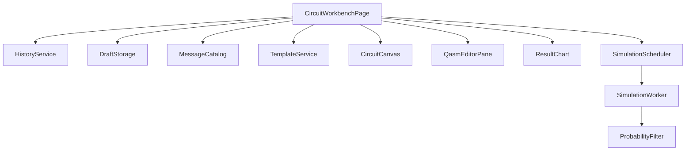

# Design Document

## Overview

本设计面向图形化量子工作台的第二轮 UX 迭代，范围覆盖：
- 双比特门放置引导强化
- 中文错误与状态提示统一
- 撤销/重做/清空等编辑效率能力
- QASM 联动稳定性优化
- 概率结果可解释性增强（阈值说明与显示模式切换）
- 新手模板与首次引导
- 本地草稿持久化与恢复

本轮设计明确不涉及：
- 移动端拖拽替代方案（需求点 1）
- 响应式布局重排（需求点 2）
- 仿真调度参数与超时策略变更（需求点 3）

实现边界：仅前端改造，不新增后端接口，不变更数据库结构。

## Steering Document Alignment

### Technical Standards (tech.md)
项目未提供独立 `tech.md`，本设计按现有代码和 `project-memory.md` 的技术栈约束执行：
- 前端继续使用 React + TypeScript + Vite。
- 继续复用现有 `features/circuit` 分层：`model / qasm / simulation`。
- 仅在前端引入轻量状态与本地存储模块，不引入新框架依赖。

### Project Structure (structure.md)
项目未提供独立 `structure.md`，本设计遵循现有目录组织：
- 页面编排在 `frontend/src/pages/CircuitWorkbenchPage.tsx`
- 交互组件在 `frontend/src/components/circuit/*`
- 领域逻辑在 `frontend/src/features/circuit/*`
- 测试在 `frontend/src/tests/*`

新增代码将保持“页面编排 + 领域模块 + 组件展示”分离，避免把业务逻辑堆叠在页面组件内。

## Code Reuse Analysis

### Existing Components to Leverage
- **CircuitWorkbenchPage**：继续作为状态编排入口，新增工具栏、模板入口、显示模式切换和持久化接入点。
- **CircuitCanvas**：复用现有拖拽/点击逻辑，增强双比特门引导提示与快捷操作入口。
- **QasmEditorPane**：保留编辑器组件，强化解析触发策略与错误提示时机。
- **QasmErrorPanel**：保留错误面板，统一中文文案和修复建议结构。
- **ResultChart**：复用图表渲染，仅扩展显示模式切换与阈值说明展示。
- **circuit-model / qasm-bridge / probability-filter**：作为核心模型与转换能力继续复用。

### Integration Points
- **路由入口**：继续使用现有 `/tasks/circuit`，不新增后端页面路由。
- **仿真链路**：继续走 `CircuitModel -> scheduler -> simulation worker -> probability filter -> chart`。
- **本地存储**：新增 `localStorage` 读写模块，仅保存工作台草稿与引导偏好，不与服务端同步。

## Architecture

采用“页面状态编排 + 领域服务模块 + 纯展示组件”模式：

1. 页面层维护工作台聚合状态（线路、QASM、仿真态、显示模式、引导状态）。
2. 历史管理、模板加载、草稿持久化、中文提示映射拆分为独立服务函数。
3. 组件层只接受显式 props，不直接访问存储或仿真层。
4. 解析失败与恢复路径保持显式错误，不做静默回退。

### Modular Design Principles
- **Single File Responsibility**:  
  `history` 只做撤销/重做；`draft-storage` 只做持久化；`message-catalog` 只做文案映射。
- **Component Isolation**:  
  `CircuitCanvas` 只负责画布交互；`QasmEditorPane` 只负责编辑输入；`ResultChart` 只负责可视化。
- **Service Layer Separation**:  
  页面触发服务调用，服务返回纯数据，不耦合 React 生命周期。
- **Utility Modularity**:  
  过滤、模板、文案、草稿各自独立，避免重复逻辑散落在页面和组件中。



## Components and Interfaces

### WorkbenchStateCoordinator（由 CircuitWorkbenchPage 承担）
- **Purpose:** 聚合并协调“线路编辑、QASM 输入、仿真刷新、历史栈、草稿恢复、模板加载”。
- **Interfaces:**  
  `onCircuitChange(next)`、`onValidQasmChange(next)`、`onUndo()`、`onRedo()`、`onClearCircuit()`、`onSelectTemplate(id)`、`onToggleDisplayMode(mode)`。
- **Dependencies:** `history service`、`draft storage`、`message catalog`、`scheduler`。
- **Reuses:** 现有 `CircuitCanvas`、`QasmEditorPane`、`QasmErrorPanel`、`ResultChart`。

### History Service（新增）
- **Purpose:** 提供可预测的撤销/重做能力，维护 `past/present/future` 结构。
- **Interfaces:**  
  `createHistory(initial)`、`push(next)`、`undo()`、`redo()`、`canUndo`、`canRedo`。
- **Dependencies:** `CircuitModel` 与序列化比较工具。
- **Reuses:** 现有 `normalizeCircuitQasm` 的等价比较思想，避免无意义重复入栈。

### Draft Storage（新增）
- **Purpose:** 管理工作台草稿与引导偏好的本地持久化。
- **Interfaces:**  
  `saveDraft(payload)`、`loadDraft()`、`clearDraft()`、`saveGuideDismissed(flag)`、`isGuideDismissed()`。
- **Dependencies:** `localStorage`、payload 校验函数。
- **Reuses:** `CircuitModel` + `QASM` 现有结构，不改后端契约。

### Message Catalog（新增）
- **Purpose:** 把交互错误、解析错误、仿真状态映射为统一中文文案（含修复建议）。
- **Interfaces:**  
  `toCanvasMessage(code, context)`、`toQasmMessage(error)`、`toSimulationStateLabel(state)`。
- **Dependencies:** `QasmParseError`、画布交互上下文。
- **Reuses:** 现有错误对象结构，不改错误抛出源头。

### Template Service（新增）
- **Purpose:** 提供可加载模板（Bell 等）及对应元数据。
- **Interfaces:**  
  `listTemplates()`、`loadTemplate(id): CircuitModel`。
- **Dependencies:** `CircuitModel`。
- **Reuses:** 现有 `INITIAL_CIRCUIT` 初始化样式。

## Data Models

### WorkbenchDisplayMode
```ts
type WorkbenchDisplayMode = "FILTERED" | "ALL";
```

### WorkbenchDraftPayload
```ts
interface WorkbenchDraftPayload {
  version: 1;
  circuit: CircuitModel;
  qasm: string;
  displayMode: WorkbenchDisplayMode;
  updatedAt: number;
}
```

### EditorHistoryState
```ts
interface EditorHistoryState<T> {
  past: readonly T[];
  present: T;
  future: readonly T[];
}
```

### Local Guide Preference
```ts
interface WorkbenchGuidePreference {
  dismissed: boolean;
}
```

### LocalizedMessage
```ts
interface LocalizedMessage {
  title: string;
  detail: string;
  suggestion?: string;
}
```

## Error Handling

### Error Scenarios
1. **双比特门放置步骤错误（层不一致/重复量子位/目标格已占用）**
   - **Handling:** 返回结构化中文提示（问题 + 建议），保持当前待放置状态不丢失。
   - **User Impact:** 用户明确知道“下一步该怎么做”，不会陷入无反馈状态。

2. **QASM 解析失败**
   - **Handling:** 仅更新错误面板，不覆盖当前有效线路，不触发错误线路仿真。
   - **User Impact:** 用户可以继续编辑修复，图形区保持最近可用状态。

3. **本地草稿损坏或版本不兼容**
   - **Handling:** 显式忽略草稿并记录控制台错误；回退默认初始线路。
   - **User Impact:** 不会卡死页面，用户仍可正常进入工作台。

4. **撤销/重做边界操作（空栈）**
   - **Handling:** UI 按钮禁用；调用时返回 no-op。
   - **User Impact:** 行为可预期，无“点击无效但不知原因”的体验。

5. **仿真失败或结果为空**
   - **Handling:** 保持中文状态与错误提示，并显示空态文案。
   - **User Impact:** 知道当前失败状态与可观察后果，不出现空白图表。

## Testing Strategy

### Unit Testing
- `history service`：`push/undo/redo`、边界条件、无变化不入栈。
- `draft storage`：正常保存/读取、损坏 payload 处理、版本校验。
- `message catalog`：关键错误码到中文文案映射一致性。
- `template service`：模板加载结构合法性（qubits/depth/gates 限制内）。

### Integration Testing
- 画布编辑 -> 撤销/重做 -> QASM 同步 -> 仿真结果刷新闭环。
- QASM 输入错误 -> 错误面板中文展示 -> 修复后自动恢复同步。
- 显示模式切换（过滤/全部）与统计信息联动正确。
- 清空线路后可通过撤销恢复。
- 刷新页面后草稿自动恢复。

### End-to-End Testing
- 新用户路径：进入页面 -> 读取引导 -> 加载 Bell 模板 -> 调整门参数 -> 查看直方图。
- 高频编辑路径：连续增删门 + 撤销重做 + 清空恢复，无状态错乱。
- 错误恢复路径：输入错误 QASM -> 查看中文修复提示 -> 修复成功 -> 结果恢复。
